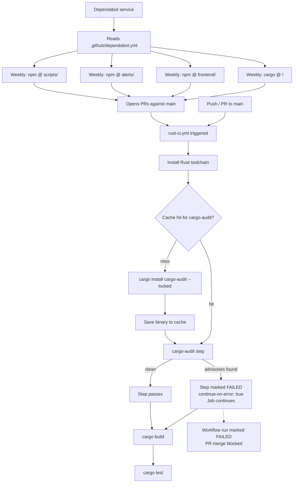

# Design Document

## Overview

This design covers two configuration files that together automate dependency maintenance and security auditing for the TurboLong monorepo:

1. **`.github/dependabot.yml`** — instructs GitHub's Dependabot service to open weekly PRs for all four dependency ecosystems (one Cargo workspace, three npm packages).
2. **`.github/workflows/rust-ci.yml`** — a new GitHub Actions workflow that runs on every push and PR to `main`, installing and executing `cargo-audit` before building and testing the Rust workspace.

Neither file contains application logic. The design decisions are about YAML structure, step ordering, caching strategy, and the permissions model that allows Dependabot PRs to trigger the CI job.

---

## Architecture



The two files are independent — `dependabot.yml` is consumed by GitHub's hosted Dependabot service, while `rust-ci.yml` is a standard Actions workflow. They interact only in that Dependabot PRs trigger the CI workflow.

---

## Components and Interfaces

### `.github/dependabot.yml`

The file uses Dependabot configuration schema version 2. It declares four `updates` entries — one per ecosystem/directory combination. All entries share the same schedule.

**Key fields per entry:**

| Field | Value | Purpose |
|---|---|---|
| `package-ecosystem` | `"cargo"` or `"npm"` | Tells Dependabot which manifest format to read |
| `directory` | `"/"`, `"frontend/"`, `"alerts/"`, `"scripts/"` | Root-relative path to the manifest |
| `schedule.interval` | `"weekly"` | Batch updates to once per week |
| `schedule.day` | `"monday"` | Consistent day so PRs arrive predictably |

The `cargo` entry targets `/` because the workspace root `Cargo.toml` and `Cargo.lock` live there. Dependabot reads the lock file to determine currently resolved versions and compares against the registry.

### `.github/workflows/rust-ci.yml`

A single-job workflow (`ci`) with the following step sequence:

1. `actions/checkout@v4` — checks out the repository
2. `dtolnay/rust-toolchain@stable` — installs the stable Rust toolchain
3. `actions/cache@v4` (restore) — attempts to restore the `cargo-audit` binary from cache
4. `cargo install cargo-audit --locked` — installs if cache miss (skipped on hit via `if:` condition)
5. `actions/cache@v4` (save) — saves the binary on cache miss
6. `cargo audit` — runs the audit; `continue-on-error: true`
7. `cargo build` — compiles the workspace
8. `cargo test` — runs all tests

**Trigger configuration:**

```yaml
on:
  push:
    branches: [main]
  pull_request:
    branches: [main]
```

**Permissions:**

```yaml
permissions:
  contents: read
```

`contents: read` is the minimum permission needed to check out the repository and read `Cargo.lock`. It is also the permission level that Dependabot PRs receive by default, ensuring the workflow runs on Dependabot-opened PRs without requiring elevated tokens.

---

## Data Models

### Dependabot Config Schema (v2)

```yaml
version: 2
updates:
  - package-ecosystem: string   # "cargo" | "npm"
    directory: string           # path relative to repo root
    schedule:
      interval: string          # "weekly"
      day: string               # "monday"
```

Each entry is independent. Dependabot processes them separately and opens separate PRs per ecosystem per directory.

### Rust CI Workflow Structure

```yaml
name: string
on:
  push:
    branches: [string]
  pull_request:
    branches: [string]
permissions:
  contents: string              # "read"
jobs:
  ci:
    runs-on: string             # "ubuntu-latest"
    steps:
      - uses: string            # action reference
        with: object            # action inputs
      - name: string
        run: string             # shell command
        id: string              # step ID for cache condition
        if: string              # conditional expression
        continue-on-error: bool # true for cargo-audit step only
```

### Cache Key Design

The cache key for the `cargo-audit` binary uses the following components:

```
${{ runner.os }}-cargo-audit-${{ env.CARGO_AUDIT_VERSION }}
```

Where `CARGO_AUDIT_VERSION` is set as a workflow-level environment variable (e.g., `"0.21.0"`). This means:

- A new version of `cargo-audit` gets a fresh cache entry (no stale binary)
- The same version on the same OS always hits the cache after the first install
- Changing the version in the workflow env var automatically invalidates the old cache

The cached path is `~/.cargo/bin/cargo-audit` (the binary itself) plus `~/.cargo/.crates.toml` and `~/.cargo/.crates2.json` (Cargo's install registry, needed for `--locked` to work correctly on restore).

---

## Error Handling

### `continue-on-error: true` on the audit step

`continue-on-error: true` tells GitHub Actions to mark the step as failed (red ✗ in the UI, non-zero exit code recorded) but to continue executing subsequent steps in the job. This means:

- `cargo build` and `cargo test` still run even when advisories are found
- Maintainers get full CI output (build errors, test failures) in the same run
- The **overall workflow run** is still marked as failed when any step has `continue-on-error: true` and exits non-zero — this is the default GitHub Actions behavior
- A failed workflow run blocks PR merge when branch protection requires the `ci` check to pass

This is the correct behavior: advisories surface as a visible failure without hiding other CI results.

### Advisory output

`cargo audit` prints advisory details to stdout in the following format by default:

```
error[RUSTSEC-YYYY-NNNN]: <advisory title>
    --> Cargo.lock:NN:NN
     |
  NN | <crate-name> = "version"
     |
     = ID: RUSTSEC-YYYY-NNNN
     = Description: ...
     = Affected versions: <range>
     = Fixed versions: <range>
```

No additional flags are needed — the advisory ID, affected crate name, and severity are included in the default output, which appears in the GitHub Actions step log.

### Cache miss handling

If the cache action fails to restore (network issue, cache eviction), the `if: steps.cache-audit.outputs.cache-hit != 'true'` condition on the install step ensures `cargo install` runs as a fallback. The workflow never fails due to a cache miss.

---

## Testing Strategy

Property-based testing is not applicable to this feature. Both deliverables are static YAML configuration files consumed by external services (GitHub Dependabot, GitHub Actions). There are no pure functions, data transformations, or business logic to test with generated inputs.

The appropriate testing strategy is:

### Smoke Tests (configuration validity)

- Validate `.github/dependabot.yml` against the [GitHub Dependabot v2 JSON schema](https://json.schemastore.org/dependabot-2.0.json) using a schema validator (e.g., `ajv`, `check-jsonschema`)
- Validate `.github/workflows/rust-ci.yml` against the [GitHub Actions workflow schema](https://json.schemastore.org/github-workflow.json)

These can be run locally with:

```bash
# Install check-jsonschema
pip install check-jsonschema

# Validate dependabot config
check-jsonschema --schemafile https://json.schemastore.org/dependabot-2.0.json .github/dependabot.yml

# Validate workflow
check-jsonschema --builtin-schema github-workflows .github/workflows/rust-ci.yml
```

### Example-Based Unit Tests (structural assertions)

Parse the YAML files and assert specific field values:

- `dependabot.yml`: `version == 2`, four entries present, each entry has correct `package-ecosystem`, `directory`, `schedule.interval: weekly`, `schedule.day: monday`
- `rust-ci.yml`: triggers include `push.branches: [main]` and `pull_request.branches: [main]`; `permissions.contents == "read"`; cargo-audit step has `continue-on-error: true`; step order is toolchain → cache restore → install (conditional) → audit → build → test

### Integration Tests (live behavior)

- Run `cargo audit` against the current `Cargo.lock` in CI to verify it executes without configuration errors
- Verify the cache save/restore cycle works by checking `cache-hit` output on a second run
- Observe Dependabot PR creation after committing `dependabot.yml` (manual verification, not automatable)

### What is not tested

- GitHub Dependabot's PR deduplication logic (Requirement 2.3) — this is GitHub service behavior
- Dependabot's semver comparison logic (Requirement 2.5) — this is GitHub service behavior
- The exact advisory output format (Requirement 3.5) — this is `cargo-audit` tool behavior, tested by the RustSec project
