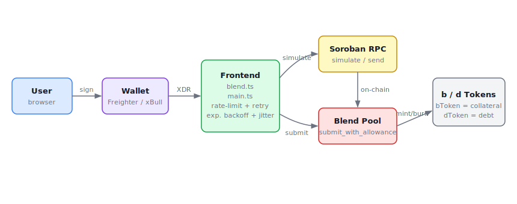

# TurboLong

Leveraged long positions on [Blend Protocol](https://blend.capital) — Stellar / Soroban.

## Architecture



| Layer | Description |
|---|---|
| **User** | Interacts via browser |
| **Wallet** | Freighter, xBull, Albedo, Lobstr, Hana — signs XDR |
| **Frontend** | `blend.ts` + `main.ts` — builds transactions, rate-limits RPC calls with exponential backoff |
| **Soroban RPC** | Simulates and submits Soroban transactions |
| **Blend Pool** | `submit_with_allowance` — atomic supply / borrow / repay / withdraw |
| **b / d Tokens** | bToken = collateral receipt, dToken = debt receipt |

## Quickstart

```bash
cd frontend
npm install
npm run dev
```

## Docs

- [`doc.md`](doc.md) — strategy overview
- [`profitability_analysis.md`](profitability_analysis.md) — rate and profit modelling
- [`CONTRIBUTING.md`](CONTRIBUTING.md) — contribution guide
