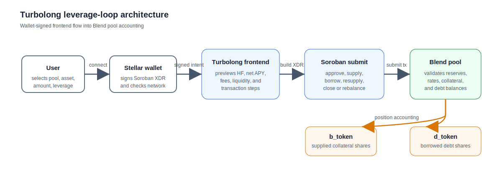

# Turbolong

Turbolong is a Stellar/Blend leverage-loop interface and strategy workspace. The frontend helps users connect a Stellar wallet, select a Blend pool, preview health factor and net APY, submit Soroban transactions, and monitor the resulting Blend position.

## Architecture

The main flow is a wallet-mediated Soroban transaction path. The user chooses a pool and leverage parameters in the frontend, signs with their wallet, and submits to the Soroban network. The Blend pool then accounts for supplied collateral and borrowed debt through b-token and d-token balances.



## Repository Map

- `frontend/` contains the Vite/TypeScript app for pool selection, transaction previews, wallet connection, and position monitoring.
- `contracts/` contains Soroban strategy code for Blend leverage workflows.
- `scripts/` contains local simulation and operational scripts.
- `alerts/` contains alerting-related code and worker support.
- `src/` contains shared application logic used outside the frontend bundle.
- `doc.md` contains the original leverage-loop simulation notes and math.

## Local Development

```bash
cd frontend
npm install
npm run dev
```

The Rust/Soroban simulation notes in `doc.md` include the relevant Cargo command for the Blend leverage-loop simulation.
