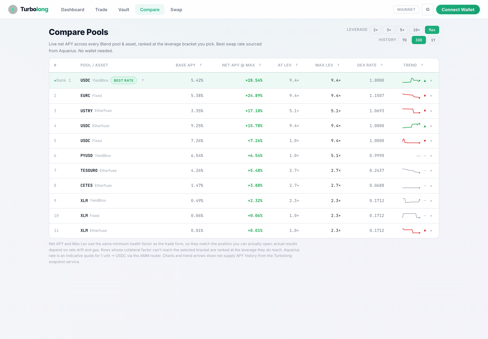
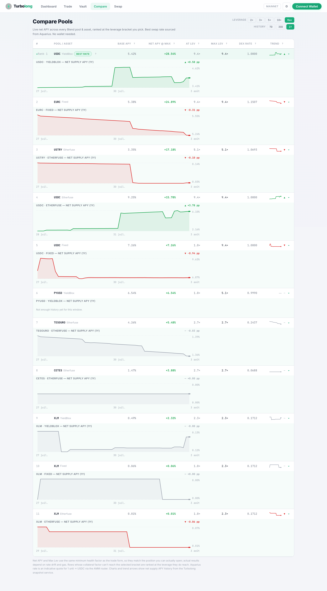
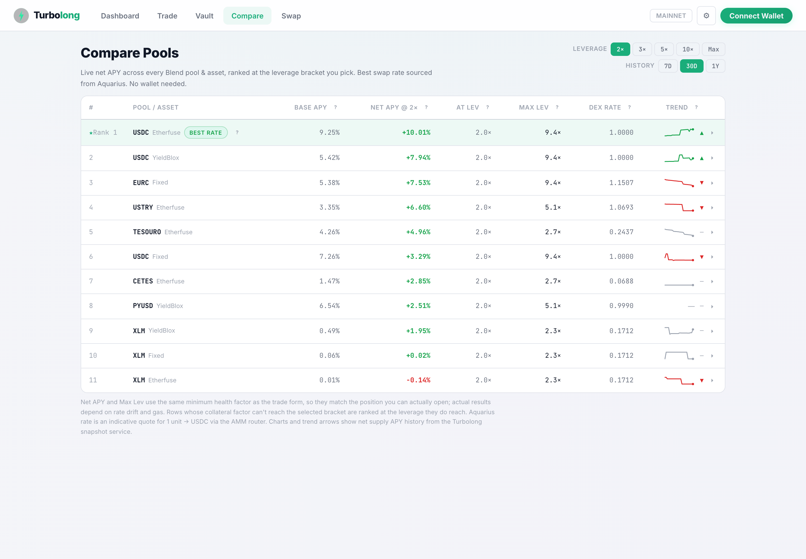

# A9 — Compare Pools UI (Aquarius + historical charts): acceptance evidence

**Date:** 2026-08-03 · **View:** `Compare` (`frontend/src/views/compare.ts`) ·
**Model:** `frontend/src/compare_model.ts` · **Chart:** `frontend/src/ui/apyChart.ts`
· **Tests:** `frontend/test/compare.test.ts` (29 cases)

Screenshots in [`compare-pools-a9/`](./compare-pools-a9/), captured against
**mainnet** data through the local dev server with **no wallet connected**.

---

## Deliverable recap

> Build out the Compare Pools view (A9) with Aquarius data on one axis and the
> T2 historical rate table on the other. 7d/30d/1y APY charts per asset;
> rate-trend arrows; cross-pool net-APY ranking at multiple leverage brackets.

| Acceptance criterion | Status 2026-08-03 |
|---|---|
| Compare Pools view deployed | ✅ shipped in-app, routed at `compare` (see §1) |
| Aquarius data on one axis | ✅ `DEX Rate` column, 1 unit → USDC (see §2) |
| T2 historical rate table on the other | ✅ `/snapshots` series → charts + arrows (see §2) |
| 7d/30d/1y APY charts per asset | ✅ per-row expandable chart, window-scoped (see §3) |
| Rate-trend arrows | ✅ sparkline + ▲/▼/— per row, window-scoped (see §3) |
| Cross-pool net-APY ranking at multiple leverage brackets | ✅ 2× / 3× / 5× / 10× / Max (see §4) |
| Charts render in < 100 ms | ✅ 57 ms for **all 11** charts; p95 4.8 ms/render at 48 rows (see §5) |
| Accessible without a wallet connection | ✅ verified headless, wallet never connected (see §6) |
| Screenshots in mainnet-launch blog post | ⛔ **not done** — no blog post exists in this repo (see §7) |

---

## 1. The view

`Compare` is a first-class nav tab (`frontend/src/app/shell.ts`), routed through
`app/state.ts` → `app/router.ts` → `app/screens.ts`. It builds synchronously with
a loading row and fills progressively as each pool's reserves resolve, so the
table is interactive before the network settles.



Live mainnet reading at capture time — 11 pool×asset rows across YieldBlox,
Fixed and Etherfuse. Reserves with `c_factor = 0` are excluded: they cannot be
looped, and their emissions-inflated APY would mis-rank the table.

## 2. The two axes

**Aquarius (`frontend/src/aquarius.ts`)** — the `DEX Rate` column is an
indicative `POST /find-path/` strict-send quote for 1 unit → USDC, routed across
the aggregated Stellar DEX surface. USDC is pinned to `1.0000`; a pair with no
feasible route renders `n/a` rather than a misleading zero.

**T2 snapshot service (`frontend/src/history.ts`)** — `fetchSnapshotSeries()`
pulls the 15-minute `net_supply_apr` series from the alerts Worker's
`/snapshots` endpoint (the T2.5 `rate_snapshots` D1 table). That single series
drives the sparkline, the trend arrow, and the expanded chart.

Both are fetched per row in parallel, each failing independently — a dead
Aquarius route never blanks the history, and vice versa.

## 3. Windows, charts and arrows

Selecting `7D` / `30D` / `1Y` slices the series by timestamp
(`compare_model.sliceWindow`), so the sparkline, the arrow **and** the expanded
chart all describe the selected window.

> **Bug fixed here.** The window chips previously only changed sparkline
> *density* — `resample(vals, WIN_POINTS[win])` over the full year-long series.
> Every chip drew the same line, and the trend arrow always described a year no
> matter which chip was lit. `test/compare.test.ts` pins this with a series that
> rises over the year but falls over the last week: `1Y` → `up`, `7D` → `down`.

Each row expands to a full `ApyChart` — line over an area fill, min/max
gridline labels, date ticks, and the end-to-end move in percentage points.



Note PYUSD · YieldBlox degrading to "Not enough history yet for this window."
rather than drawing a misleading flat line. The snapshot service has been
accumulating since 2026-07-16, so at capture time the `1Y` window legitimately
contains ~1 week of data; the axis labels the real range it has.

## 4. Leverage brackets

The ranking is computed at a selected bracket — `2×`, `3×`, `5×`, `10×`, or
`Max` — via `compare_model.rankRows()`.

- **`Max` is carry-optimal, not maximal.** When the carry
  (`netSupplyApr − netBorrowCost`) is negative, every extra leverage unit loses
  money, so the optimum is 1×. Five rows in the screenshot above sit at `1.0×`
  under `Max` for exactly this reason.
- **Numeric brackets clamp to `safeLev`** and flag themselves. Asking for 10× on
  a reserve topping out at 2.7× reports 2.7× in the `At Lev` column with a dotted
  underline and a tooltip, rather than quoting a position nobody can open.
- `Max Lev` and the clamp both use the **same `minHF` as the Trade form**
  (1.01 normal / 1.00001 expert), so the ranking matches openable positions.

The winner genuinely changes with the bracket — verified in the headless run:

| Bracket | Top 5 by net APY |
|---|---|
| `2×` | USDC, USDC, EURC, USTRY, TESOURO |
| `10×` | USDC, EURC, USTRY, USDC, TESOURO |



## 5. Render budget

The DOM-free work — window slicing, resampling, ranking, path building — is what
scales with the table, so it is what the budget bounds.

Measured over 600 renders per table size (Node 23, M-series, after warm-up):

| Rows | p50 | p95 | max |
|---|---|---|---|
| 12 | 1.25 ms | 2.85 ms | 7.89 ms |
| 24 | 2.38 ms | 5.61 ms | 7.56 ms |
| 48 | 4.79 ms | 10.71 ms | 16.93 ms |

48 rows is larger than any live Blend deployment. In the browser, expanding
**all 11 charts at once** — DOM construction plus a forced layout — measured
**57 ms**, inside the 100 ms budget for the whole batch rather than per chart.

`test/compare.test.ts › render budget` guards this in CI.

## 6. No wallet required

Reserves are fetched with an empty user address
(`fetchAllReserves(pool, getState().userAddress ?? "")`), so nothing on the
screen depends on a connected wallet.

Verified headless: the run navigated to Compare without ever invoking the wallet
kit, asserted no `G…` address appears anywhere in the DOM
(`walletConnected: false`), and rendered 11 rows, 8 chips and 11 charts with an
empty console-error list. The `Connect Wallet` button is visible but untouched
in every screenshot.

One caveat, unrelated to wallets: a one-time **risk disclaimer** modal gates the
whole app on first visit. It is an app-wide gate, not a Compare-specific or
wallet-specific one, and it is dismissed without connecting anything.

## 7. Outstanding

**The mainnet-launch blog post does not exist in this repo** — no `blog/`,
`content/`, or post draft under `landing/`. The screenshots this criterion calls
for are captured and committed under
[`docs/evidence/compare-pools-a9/`](./compare-pools-a9/), ready to drop in, but
the criterion cannot close until the post itself is written and published.

### Reproducing

```bash
cd frontend
npm test                     # 29 compare cases incl. the render budget
npm run dev                  # then open the Compare tab; no wallet needed
```

On `localhost` the snapshot Worker CORS-rejects the origin (it allows only
`https://app.turbolong.com`), so history renders empty and the Trend column
shows `—`. That is a local-dev artifact, not a defect; the screenshots above
were captured with the `/snapshots` request proxied through the allowed origin.
